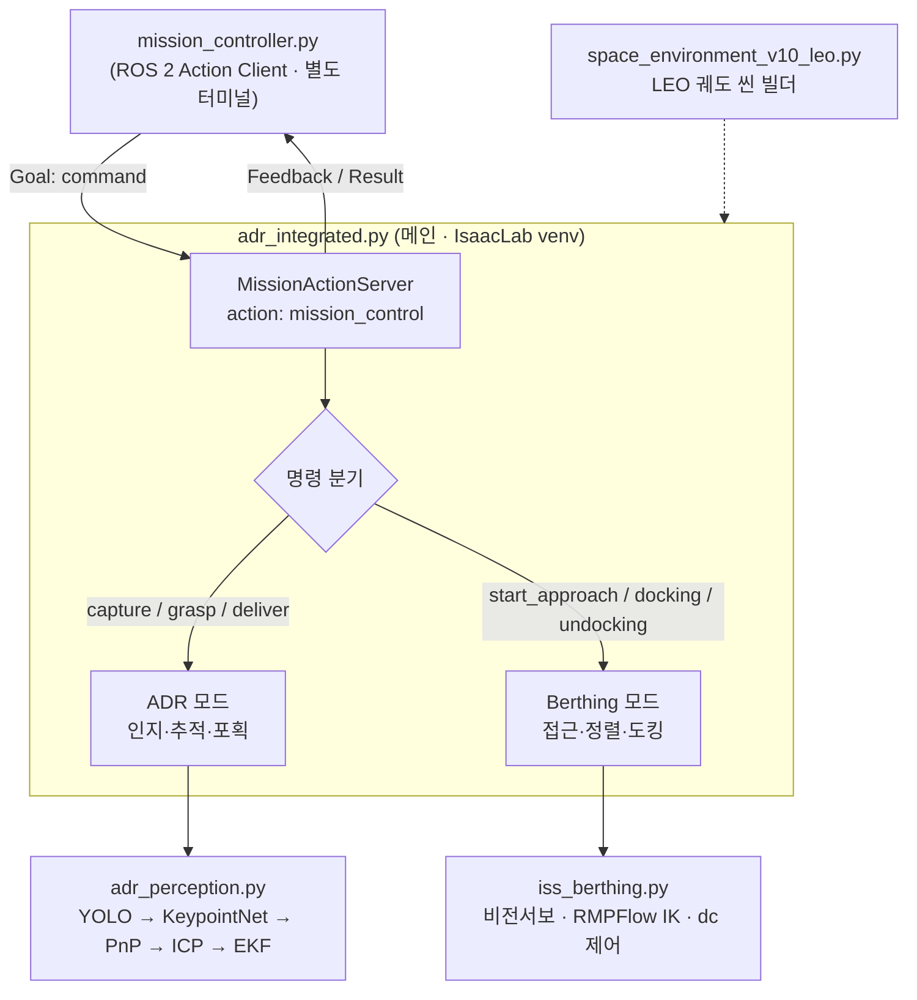
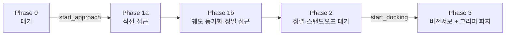

# ADR 인지·추적 & 우주 정거장 도킹 통합 시스템 (Isaac Sim 5.1.0 / IsaacLab)

LEO 체이서 위성이 (1) 텀블링하는 비협조 표적(사다리 형상 잔해)을 자율 포획하고,
(2) 우주 정거장에 자율 도킹(berthing)하는 **통합 시뮬레이션**.
단일 진입점 `adr_integrated.py`가 ROS 2 Action 명령에 따라 **ADR 포획 모드**와
**정거장 도킹 모드**를 전환하며 실행한다.

> **통합 변경점**: 통합 전에는 `adr_integrated.py`(ADR)와 `iss_berthing.py`(도킹)가
> 서로 독립적인 시나리오였으나, 현재는 `iss_berthing.py`가 `adr_integrated.py`에
> **모듈로 통합**되어 하나의 프로세스에서 ROS 명령으로 두 시퀀스를 모두 수행한다.
> 또한 실행 환경이 Isaac Sim 번들 파이썬(`./python.sh`)에서 **IsaacLab venv**로 바뀌었다.

---

## 1. 주요 기능

- **다단계 인지 파이프라인** — 원거리(지상 카탈로그 EKF) → 중거리(Mono RGB YOLO +
  KeypointNet + PnP 6D pose) → 근거리(LiDAR + ICP)
- **ADR 포획 시퀀스** — 자율 랑데부 → 추적 → 그래스핑 → R2D2 전달 (`capture`/`grasp`/`deliver`)
- **정거장 도킹(Berthing)** — 5단계 상태머신: 대기 → 직선 접근 → 정밀 접근 → 정렬 → 비전 도킹
- **손목캠 Closed-loop Look-at** — 손목 RealSense의 실제 시선축을 매 프레임 측정해
  도킹 핸들을 정조준 (카메라 마운트 오차에 무관)
- **공전 표적 추종** — 궤도 속도를 피드포워드로 보상하며 이동하는 핸들/표적을 추적
- **ROS 2 Action 미션 제어** — `mission_controller`(클라이언트)가 `mission_control`
  액션으로 명령 전송, 실시간 Feedback / Result 수신
- **물리 기반 자율 제어** — 자유비행 체이서(RigidPrim 힘/토크) + Doosan M0609 + OnRobot RG2,
  `dynamic_control`로 PhysX 드라이브 직접 제어, RMPFlow IK, 쿼터니언 PD 자세제어

---

## 2. 시스템 설계 / 플로우차트

### 2.1 시스템 아키텍처



### 2.2 도킹 파이프라인 (Phase 상태머신)



---

## 3. 운영체제 / 실행 환경

| 항목 | 사양 |
|------|------|
| OS | Ubuntu 22.04 LTS |
| 시뮬레이터 | NVIDIA Isaac Sim **5.1.0** + IsaacLab |
| Python | **3.11** (IsaacLab venv: `/home/rokey/dev_ws/venv/isaaclab/bin/python`) |
| ROS 2 | **Humble** (`mission_controller` 클라이언트 / `mission_interfaces` 액션 패키지) |
| CUDA | cu128 (CUDA 12.8) |

> ⚠️ 메인 스크립트는 Isaac Sim 번들 파이썬(`./python.sh`)이 아니라 **IsaacLab venv 파이썬**으로 실행한다.
> 메인 프로세스는 시작 시 `/opt/ros` 경로 충돌을 제거하고 Isaac 번들 `rclpy`를 주입한 뒤 자체 재시작하므로,
> **메인 터미널에서는 ROS 2를 source 하지 않는다.** (ROS source 는 `mission_controller` 터미널에서만.)

---

## 4. 사용 장비 / 플랫폼

**개발 머신**
- HP Victus 노트북
- NVIDIA GeForce RTX 4060

**시뮬레이션 로봇 / 센서**
- Doosan **M0609** 6축 협동로봇 (자유비행 체이서 본체에 탑재)
- OnRobot **RG2** 그리퍼
- Intel RealSense **D455** (손목 장착, Phase 3 비전 서보)
- 시뮬 LiDAR (근거리 ICP 정합)

---

## 5. 의존성 (`requirements.txt`)

```text
# === IsaacLab venv 내 pip 설치 ===
torch==2.7.0              # +cu128 (CUDA 12.8 휠/인덱스로 설치)
numpy==1.26.4             # 2.x 는 omni.syntheticdata 를 깨뜨림 — 반드시 1.26.4
opencv-python==4.8.1.78
ultralytics~=8.4.0
open3d==0.18.0
scipy                     # iss_berthing 자세제어(scipy.spatial.transform)
trimesh                   # PnP/ICP CAD 프레임

# === pip 로 설치하지 않음 (별도 제공) ===
# isaacsim, omni.*, pxr   → Isaac Sim 5.1.0 설치에서 제공
# rclpy                   → ROS 2 Humble / Isaac 번들에서 주입
# mission_interfaces      → 아래 6.0 단계에서 colcon 빌드
```

---

## 6. 실행 순서

> 작업 디렉터리(예시):
> `/home/rokey/dev_ws/isaac_sim/IsaacLab/space_debris/space_debris_integrate_final/scripts/`

### 6.0 ROS 2 액션 인터페이스 빌드 (최초 1회)

```bash
cd <ros2_ws>                                   # mission_interfaces 가 있는 워크스페이스
colcon build --packages-select mission_interfaces
source install/setup.bash
```

### 6.1 파일 / 에셋 준비

```bash
# (1) 인지 모듈 파일명 정리 — adr_integrated.py 가 'import adr_perception' 으로 가져옴
mv adr_perception__1_.py adr_perception.py

# (2) 다음 스크립트를 같은 폴더(또는 PYTHONPATH 상)에 둔다
#     adr_integrated.py
#     iss_berthing.py
#     space_environment_v10_leo.py
#     adr_perception.py
#     mission_controller.py
#
# (3) 모델/데이터/에셋(아래 7장) 및 외부 모듈(URDF, m0609_pick_place_controller 등) 배치
#     경로가 본인 환경과 다르면 adr_integrated.py 상단 상수를 직접 수정
```

### 6.2 터미널 A — 메인 시뮬레이션 실행

```bash
cd /home/rokey/dev_ws/isaac_sim/IsaacLab/space_debris/space_debris_integrate_final/scripts

# IsaacLab venv 파이썬으로 직접 실행 (ROS source 하지 말 것 — 스크립트가 내부 처리)
/home/rokey/dev_ws/venv/isaaclab/bin/python adr_integrated.py
```

- GUI가 뜨면 **▶ PLAY** 를 눌러야 물리/궤도 루프가 돈다.
- 시작 로그에서 `[INTEGRATED] ROS 2 Action Server 'mission_control' 생성 완료` 가 뜨면 명령 대기 상태.
- 첫 실행은 GLB→USD 변환으로 느리다. 안정되면 `space_environment_v10_leo.py` 의
  `FORCE_RECONVERT_ASSETS = False` 로 바꿔 재변환을 건너뛴다.
- 인지/카메라 디버그 이미지는 파일로 저장된다(headless OpenCV): `~/yolo_debug_frames/latest.jpg`,
  LiDAR/포인트클라우드: `~/lidar_debug/`.

### 6.3 터미널 B — 미션 명령 전송 (ROS 2 클라이언트)

```bash
# 이 터미널에서만 ROS 2 를 source
source /opt/ros/humble/setup.bash
source <ros2_ws>/install/setup.bash            # mission_interfaces

python3 mission_controller.py                  # 명령을 Goal 로 전송
```

### 6.4 미션 명령 시퀀스 (예시)

| 순서 | 명령 | 동작 |
|------|------|------|
| 1 | `start_approach` | 정거장으로 랑데부·접근 (Phase 1) |
| 2 | `start_docking` | 손목캠 비전 서보 + 그리퍼 도킹 (Phase 3) |
| 3 | `start_undocking` | 분리 |
| 4 | `capture` | ADR 모드 — 사다리 잔해 자율 포획 |
| 5 | `grasp` | 그래스핑 |
| 6 | `deliver` | R2D2 에 전달 |

---

## 7. 필요한 모델 · 데이터 · 에셋

> **에셋(GLB/USD/USDZ) 및 R2D2 모델은 아래 GitHub 에서 다운로드:**
> ### 👉 https://github.com/SuhyunMin/R2D2.git

```bash
git clone https://github.com/SuhyunMin/R2D2.git
# 받은 에셋을 adr_integrated.py / space_environment_v10_leo.py 의 지정 경로에 배치
```

**모델 / 데이터 (경로는 스크립트 상단에 하드코딩 — 본인 환경에 맞게 수정):**
- YOLO 가중치 `best.pt`
- KeypointNet 체크포인트 `best.pt` (형식: `{model, num_kp=9, crop=256, hm=64}`)
- 3D 키포인트 `keypoints_3d.json`

**에셋 (위 GitHub):** earth, sci-fi_space_station, space_satellite, R2D2,
사다리 잔해(`ladder_metallic_tool`), nasa_astronaut_helmet, wall-e, meteorite, UFO 등

**로봇 / 외부 모듈:**
- Doosan M0609 URDF · OnRobot RG2 URDF · R2D2.usd
- `m0609_pick_place_controller.py`
- iss_berthing 의존 리소스: `m0609_rg2_description.yaml`, `m0609_rmpflow_common.yaml`,
  `wrist_camera`, `visual_servo_controller`, `realsense_mount`, `camera_viewer`, `doosan_loader`

---

## 8. 파일 구성

| 파일 | 역할 | 진입점? |
|------|------|---------|
| `adr_integrated.py` | **메인 통합 진입점.** 씬 빌드 → 인지/추적/제어 + ROS Action 서버 + 도킹(berthing) | ✅ 직접 실행 |
| `iss_berthing.py` | 정거장 도킹 모듈 (비전서보·RMPFlow IK·dc 제어). 메인이 import | ❌ import 전용 |
| `space_environment_v10_leo.py` | LEO 궤도 환경 빌더 (스케일 Kepler 물리). `build_scene()` | ✅ standalone / import |
| `adr_perception.py` | 인지 함수 모음 (YOLO + KeypointNet + PnP + EKF, Isaac 비의존) | ❌ import 전용 |
| `mission_controller.py` | ROS 2 Action 클라이언트 (별도 터미널) | ✅ 직접 실행 |

---

## 9. 카메라 / 좌표계 메모

- 카메라 내부 파라미터는 **하드코딩 금지**. `_compute_intrinsics()` 가
  `focalLength=24 / horizontalAperture=20.955` + 1280×720 에서 FX=FY≈1466, CX=640, CY=360 계산.
- GLB→USD 는 Y-up→Z-up 변환 → 긴 축이 로컬 Z. identity=broadside, +90X=end-on(축퇴).
- PnP·ICP 모두 trimesh CAD 프레임 사용. `T_pnp(cad→world)` 를 ICP 초기값으로 그대로 사용.
- YOLO 는 사다리를 `collectable_debris`(conf 0.7~0.8)로 탐지.

---

## 10. 트러블슈팅

| 증상 | 원인 / 조치 |
|------|-------------|
| `ModuleNotFoundError: adr_perception` | 파일명을 `adr_perception.py` 로 리네임 |
| `No module named rclpy` | 메인은 Isaac 번들 rclpy 주입 필요 — 번들/경로 확인 |
| `isaacsim`/`omni`/`pxr` import 실패 | 시스템 python 으로 실행함. **IsaacLab venv** 파이썬 사용 |
| `omni.syntheticdata` 깨짐 | numpy 2.x 설치됨. **1.26.4** 로 다운그레이드 |
| 액션 명령 무시됨 | 명령 철자 확인(`start_approach` 등) + `mission_interfaces` 빌드/source 확인 |
| 궤도가 안 움직임 | GUI 에서 ▶ **PLAY** 안 누름 |
| 첫 실행이 너무 느림 | GLB→USD 재변환. 이후 `FORCE_RECONVERT_ASSETS=False` |
| 모델/에셋 없음 경고 | 7장 경로에 파일 배치 또는 스크립트 상단 상수 수정 |

---


